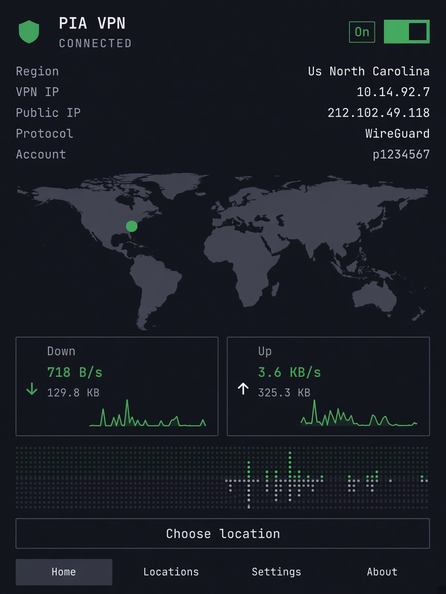

# PIA VPN for Omarchy

A native Omarchy Quattro bar plugin for [Private Internet Access](https://privateinternetaccess.com). The UI runs inside `omarchy-shell`; the tunnel stays in the official PIA Linux daemon and is driven through [`piactl`](https://helpdesk.privateinternetaccess.com/hc/en-us/articles/46815372532123-PIA-Desktop-Command-Line-Interface).

This is an independent community project. It is **not affiliated with, endorsed by, or supported by** Private Internet Access, Inc. or Omarchy.

<p align="center">
  
</p>

## Features

- Bar icon for connected / connecting / disconnected
- Left click opens the panel, right click connects or disconnects, middle click opens Home
- Sign in without putting the password on a command line (temporary file, then shred)
- Region list from `piactl get regions`, with stars to favorite locations
- Protocol (WireGuard / OpenVPN), port forwarding, LAN bypass, and kill switch
- Live down/up sparkline on Home while WireGuard is connected (reads `/sys/class/net/wgpia0`)
- World map on Locations with a pin per region; Home shows the same map with favorite pins only
- Clicking a map pin connects there; the connected region is green

## Requirements

- Arch Linux with Omarchy Quattro 4.x
- Official Private Internet Access Linux client, already installed and trusted by you (`piactl` on the system)
- PIA background mode so the daemon can run without the official GUI: `piactl background enable`

This plugin does not download, pin, or enable the official client. Install that package yourself, then enable the plugin.

## Install

```bash
omarchy plugin add https://github.com/vividhsv/omarchy-pia-vpn.git --enable
```

Omarchy warns before enabling third-party plugins because they run inside the shell process. Read the source first. Run this from an interactive terminal so you can pick a bar section; **right** is the default.

To move an existing install:

```bash
omarchy bar move pia.omarchy --section right
```

If the panel says the official client is missing, install PIA’s Linux client on your own, enable background mode, then press refresh.

### Local development

```bash
python3 scripts/check-release-tree.py
omarchy plugin validate .
mkdir -p ~/.config/omarchy/plugins
ln -sfn "$(pwd)" ~/.config/omarchy/plugins/pia.omarchy
omarchy-shell shell rescanPlugins
omarchy plugin enable pia.omarchy
```

Saving QML under `~/.config/omarchy/plugins/` reloads the plugin. If the bar does not pick it up, `omarchy restart shell`.

## Use

- `t` toggle connect (when signed in)
- `r` refresh status
- `1`–`4` Home / Locations / Settings / About
- `Esc` close
- Locations: click a star to favorite a region (favorites stay at the top of the list)

The plugin registers Quickshell IPC target `pia.omarchy` with `open`, `close`, `toggle`, `connect`, `disconnect`, and `refresh`.

## Update

```bash
omarchy plugin update pia.omarchy
```

## Remove

```bash
omarchy plugin remove pia.omarchy
```

That only removes this plugin. It does not remove the official PIA client.

## License

MIT. See [LICENSE](LICENSE) and [NOTICE.md](NOTICE.md). PIA’s own client remains under its upstream licenses.
